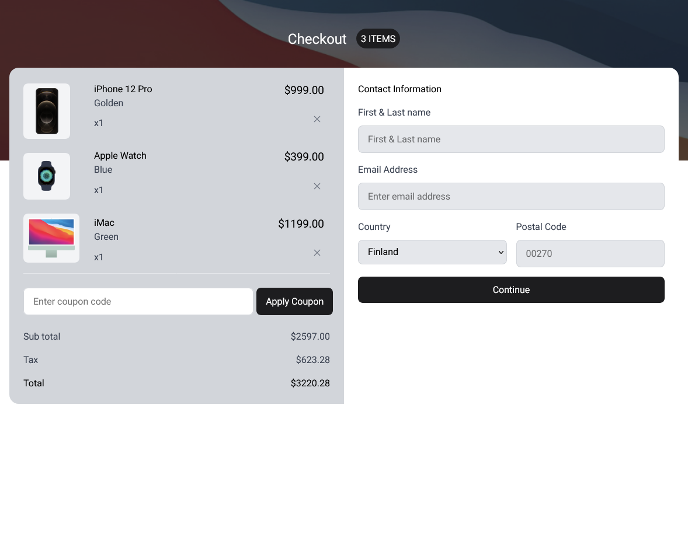

<!-- Please update value in the {}  -->

<h1 align="center">Device Shop Component | devChallenges</h1>

   Solution for a challenge <a href="https://devchallenges.io/challenge/apple-shop-checkout-page-challenge" target="_blank">Device Shop Checkout</a> from <a href="http://devchallenges.io" target="_blank">devChallenges.io</a>.

  <h3>
    <a href="https://qayoommunawar.github.io/Device-Checkout-Component/">
      Demo
    </a>
     | 
    <a href="https://github.com/qayoommunawar/Device-Checkout-Component">
      Solution
    </a>
     | 
    <a href="https://devchallenges.io/challenge/apple-shop-checkout-page-challenge">
      Challenge
    </a>
  </h3>

<!-- TABLE OF CONTENTS -->

## Table of Contents

- [Overview](#overview)
  - [What I learned](#what-i-learned)
  - [Useful resources](#useful-resources)
- [Built with](#built-with)
- [Features](#features)
- [Contact](#contact)
- [Acknowledgements](#acknowledgements)

<!-- OVERVIEW -->

## Overview

### What I learned

  working with grid and flex layout to attain desired responsiveness and layout, it was fun and time consuming.

-->

### Built with

- Semantic HTML5 markup
- CSS custom properties
- Flexbox
- CSS Grid

## Features

This application/site was created as a submission to a [DevChallenges](https://devchallenges.io/challenges-dashboard) challenge. It is responsive to a lot of extent, but requires some work to do.

